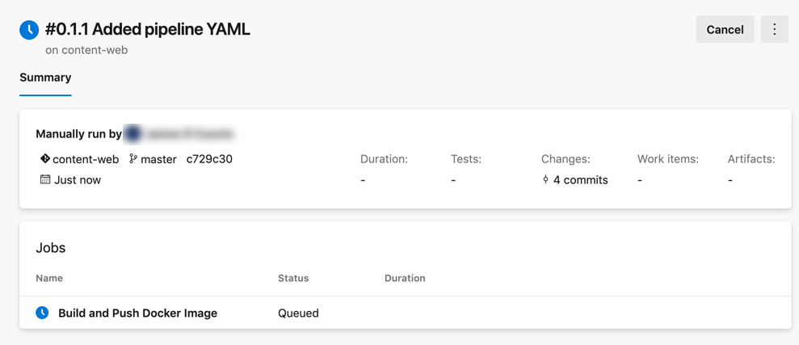
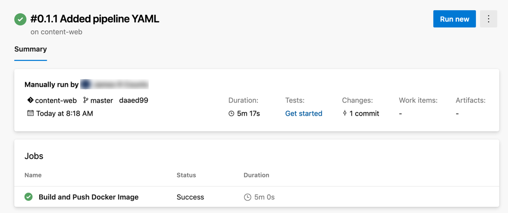

Challenge 09 - Azure Devops
=======

In this challenge, you will connect create a Pipeline in Azure Devops so you can automatically deploy the templates you have been working on so far. 

## How to


### Create an Azure DevOps Project

First we will need the templates we worked on previous challenges, in this case we will use the one on Challenge02. 

Open a **new** Azure Cloud Shell console.
Navigate to Challenge02 code folder and list the contents, you should see the template you created earlier.  
N
Now we are going to configure a repository, first we will do it locally and then we are going to add the contents on Azure DevOps repo. First set your username and email which are used for git commits, use your own information:

   ```bash
   git config --global user.email "you@example.com"
   git config --global user.name "Your Name"
   ```
Configure git CLI to cache your credentials, so that you don't have to keep re-typing them.

   ```bash
   git config --global credential.helper cache
   ```

Open a new browser tab to visit [Azure DevOps][https://dev.azure.com/] and log into your account. If you have never logged into this account, you will be taken through a first-run experience:

   - Confirm your contact information and select next.
   - Select "Create new account".
   - Enter a name for your account name and select Continue.

Now that you have your own Azure Devops Account you will need an Azure DevOps Project.

   - Enter a name for the project.
   - Ensure the project is Private.
   - Choose the Advanced dropdown.
   - Ensure the Version control is set to Git.
   - Select the "Create Project" button.

   

Now you need to enable multi-stage pipelines:

   - Select your user icon in the top right corner.
   - Then choose the three dots to access the "Preview Features" menu item.
   - Toggle multi-stage pipelines to "On".

### Initialize Azure Repos

We now have an Azure DevOps environment we now need to add out code to Azure Repos so we can version it and work with it. 

To do that, choose "Repos" then use the repository dropdown to create a new repository by selecting "+ New repository".

    

    - Enter "terraform" as the repository name.

    - Once the project is created select "Generate Git credentials".

    

Copy the Personal Access Token and save it for later steps

Using your cloud shell window, initialize a new git repository for `terraform`.

    ```bash
    copy challenge02/* challenge09/
    cd challenge09
    git init
    git add .
    git commit -m "Initial Commit"
    ```

Return to your Azure DevOps tab and copy the commands to add your Azure DevOps repository as a new remote for push. Copy the commands for "**HTTPS**" similar to this example:

    ```bash
    git remote add origin https://fabmedical-sol@dev.azure.com/fabmedical-sol/fabmedical/_git/content-web
    git push -f -u origin --all
    ```

Now use the commands copied from Azure DevOps to configure the remote repository and push the code to Azure DevOps. When prompted for a password, paste your Azure DevOps Personal Access Token you copied earlier in this task.


### Create the Pipeline

In this task you will use YAML to define a pipeline that uses terraform to deploy your infrastructure.

In your cloud shell session connected to the build agent VM, navigate to the
   `challenge09` directory:

Next create the pipeline YAML file.

   ```bash
   vi azure-pipelines.yml
   ```

   Add the following as the content: 

   ```yaml
   name: 0.1.$(Rev:r)

   trigger:
     - master

   resources:
     - repo: self

   variables:
     dockerRegistryServiceConnection: "Fabmedical ACR"
     imageRepository: "content-web"
     containerRegistry: "$(containerRegistryName).azurecr.io"
     containerRegistryName: "fabmedical[SHORT_SUFFIX]"
     dockerfilePath: "$(Build.SourcesDirectory)/Dockerfile"
     tag: "$(Build.BuildNumber)"
     vmImageName: "ubuntu-latest"

   stages:
     - stage: Build
       displayName: Build and Push
       jobs:
         - job: Docker
           displayName: Build and Push Docker Image
           pool:
             vmImage: $(vmImageName)
           steps:
             - checkout: self
               fetchDepth: 1

             - task: Docker@2
               displayName: Build and push an image to container registry
               inputs:
                 command: buildAndPush
                 repository: $(imageRepository)
                 dockerfile: $(dockerfilePath)
                 containerRegistry: $(dockerRegistryServiceConnection)
                 tags: |
                   $(tag)
                   latest
   ```

Save the pipeline YAML, then commit and push it to the Azure DevOps
   repository:

   ```bash
   git add azure-pipelines.yml
   git commit -m 'Added pipeline YAML'
   git push
   ```

Now login to Azure DevOps to create your first build. Navigate to the repository and choose 'Set up Build'.

   

Azure DevOps will automatically detect the pipeline YAML you added. You can make additional edits here if needed. Select `Run` when you are ready to execute the pipeline.

   

Azure DevOps will queue your first build and execute the pipeline when an agent becomes available.

   

The build should take a couple of minutes to complete.

   

 
When you are finished editing, select `Run` to execute the pipeline.

Review in the Azure Portal nothing must have been created so far since we have not ran `terraform apply`

### Deploy the infrastructure

Now that we have the deployment planned we need to apply it for that we will use a release pipeline. 

